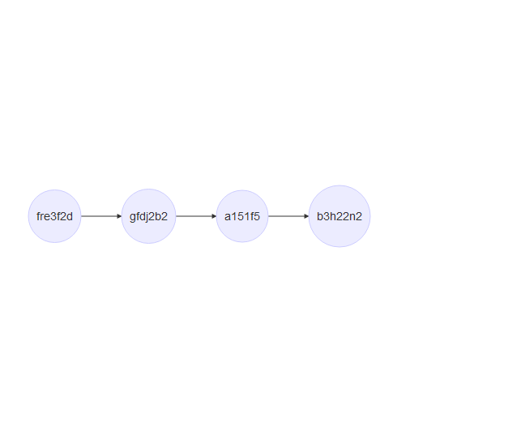
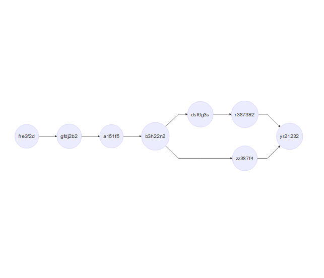

This workshop will cover the basics of packages development and collaboration in github. 

# What is a package?
A package is a portable, sharable collection of functions. While you are most likely familiar with the packages you use in your processing/analytic pipeline, there are thousands of packages, some of them publically available, some of them used by solo researchers, groups, or businesses. 

## Why should you create a package?
If you intend to share code, you should share it as a package. In fact, if you are intending to practice open science and make your analyses reproducible, [sharing your data and analyses as a package is an ideal method](http://kbroman.org/Tools4RR/assets/lectures/08_rpack.pdf). 

In a more pedestrian setting, if you find copying and pasting code across projects, it's a good sign that you should probaby just abstract that code into a package, so you can draw upon it more efficiently. 

## What is the structure of a package?

There are much better and more comprehensive descriptions of packages elsewhere, but basically an [R package](http://kbroman.org/pkg_primer/pages/minimal.html) is just a folder containing a text file called "DESCRIPTION", and a subfolder called "/R" containing some functions in .R files. You can and should have a little more structure than this (help files are important), but really it isn't that much more complicated, and there are lots of tools to help. 

## Writing Functions

Importantly, we shouldn't be packaging up a random script. Ideally we should be writing pacakges in a way that makes content accessble to users for reuse and reapplication. As such, we want to write our code into functions. 

If you haven't written a function before, dont be alarmed. 

First of all, you want to give your function a name, for our example, we're going to write a function that tells you if a character string has an odd or even number of characters. The general conventions are that function names should be:

 - Lower case
 - verbs
 - separated by underscores if multi-word.
 
So we'll call ours "is_char_even" (not exactly rolling off the tongue, but it's obvious at least).

>'There are only two hard things in Computer Science: cache invalidation and naming things.'
- Phil Karlton

Next, we need to tell R we're declaring a new function, we do this with the `function()` function (meta). `function` takes as its arguments, the arguments that you want your function to take (in our case, a character string), and then the function call should be followed by a pair of curly braces. So right now we should get to this point:

`is_char_even <- function(string) {}`

If you were to run that code, then try to apply that function to a string, it would return `NULL`, because at this point all we have is the label.  So let's add some code. Basically, we need  to count the number of characters in a string (`nchar()`) and then we need to check that that outcome is evenly divisible by 2, we'll use the modulo infix operator (`%%`).

```{r}
is_char_even <- function(string) {
  nchar(string) %% 2 == 0
}

is_char_even("roost")

is_char_even("rook")
```

Done. Simple as that.

# So what is git?

Git is a "version control system". If you have ever updated a file, and wanted to keep a record of the current and prior versions, then git has been what you have been craving. 
If you've also sworn at your past self for saving 13 poorly differentiated versions of the same document (thesis.doc, thesis_final.doc, thesis_final_1.doc...), then again, I offer you git.

Git is almost mandatory for software development, because it provides great structure for experimentation and feature adding with reduced risk of irrevocably breaking your already working code. It also allows multiple users to collaborate on the same file, not in the way you might be used to in googledocs, but still in a functional and trackable fashion.

## Why doesnt everyone use git then?

Because it's scary, and inevitably you will have troubles with it, and early troubles can encourage you to doubt whether it's all worthwhile. I promise that, like R, learning to use git is worth that frustration.

## How does it work?

Git tracks the content of a folder (which we'll designate now as a repository or "repo"), keeping a record of everything in there at each stage of a process. But rather than have duplicates of everything, it keeps a record whenever you tell it anything is added, removed or changed. These records are called  "commits" and you should think of them like save points. These allow git to have the smallest possible footprint while preserving a comprehensive record of activity in the project. 

When should you commit? Anytime you do annything worthy of a commit message. This message tells you or your collaborators what was changed at that stage, and makes it easier to track back problems when and where they emerge. This might be when you add a new function, write some documentation, or implement a test. I'm not saying commit every 30 seconds, but anytime you do something that works, [commit it](https://blog.codinghorror.com/check-in-early-check-in-often/). 


```{r, echo = FALSE, eval = FALSE}
library(DiagrammeR)
diagram1 <- 
DiagrammeR("graph LR;
1((fre3f2d)) --> 2((gfdj2b2)); 
2 -->  3((a151f5)); 
3 --> 4((b3h22n2));
"
)

```

Additionally, Git allows you to split the work, work on new sections independently, and then put them back together through processes called branching and merging.  

```{r, echo = FALSE, eval = FALSE}
DiagrammeR("graph LR;
1((fre3f2d)) --> 2((gfdj2b2)); 
2 -->  3((a151f5)); 
3 --> 4((b3h22n2));
4 -->5((dsf6g3s));
4 -->6((zz387f4));
5 -->7((r387392));
7 -->8((yr21232));
6 -->8"
)
```

## What is Github?

Github is like your cloud storage for your git projects. This works by mirroring your local repository and this is the process by which you collaborate in git. You don't all work on the exact same version interactively, instead everyone gets a copy of the repo, makes commits, then moves those commits to the remote or online repo through processes called "pushing" and "pulling". 

Once you have a grasp of commits, this is not too tricky, the terminology is even somewhat intuitive. When you want to send the commits that are on your local repo to the remote repo, you push. When you want to get the commits that have been made in the remote but don't exist in your local repo, you pull. The important thing to remember is that if you are "behind the remote" (i.e. there are commits in the remote that aren't in your local), you'll need to pull before you can push. 

This seems pretty simple, where's the hard bit?

## Merge Conflicts

So it might have occurred to you that if multiple people are working on the same code at the same time, you might have conflicting instructions. If they commit before you do, when you pull (to catch up), you may create a "merge conflict". This looks uglier than it often is, and it stops the fluent process of commit, pull, push, you might have fallen into, but you will simply need to go through the differences, clean them up, and then commit and push. When you get a conflict, git will flag the code like below:

```{r, eval=FALSE}
<<<<<<< HEAD 
Your code
========
Conflicting Code  
 >>>>>>> example/branch/source
```

So you delete the flags, eliminate one version (either delete or integrate) and the divider and you can commit and move on.

## Pull Requests

The other source of complication is working on other people's code. So far we've suggested you can just make edits, commit, and then push, but it would be odd if you could just jump into anyone's github repo and push code to overwrite theirs. This doesn't mean you can't participate in their development, we just need to ask them to pull in your code, so we call this process "making a pull request".

To make a pull request on someone else's github repo, we start by [forking their repo](https://help.github.com/articles/fork-a-repo/). This will give us our own clone of their repo in our github account. You should ideally configure git so we can keep your fork up-to-date with the upstream source. 

After forking, you'll probably clone this to your local device where you can edit it in Rstudio. You can edit and commit on your local device while preparing to give back to them. 

Before you push to your fork, you should [sync your fork](https://help.github.com/articles/syncing-a-fork/). This will ensure that you are cleaning up merge conflicts with their code before handing over your code. Once you've cleaned up merge conflicts, you're almost home. 

Now you push to your fork on github. It should be up to date with their github repo but with the added bonus of your code! We're nearly done. 

Now you initiate a [pull request](https://help.github.com/articles/about-pull-requests/). Go to the owner's repo (there'll be a link at the top of your fork's page), then press the "new pull request" button. It should automatically link to your fork, the you just need to provide a meaningful title and description of the changes and then press the big green button.

Now you just have to wait for the owner to review your code and [merge in your pull request](https://help.github.com/articles/merging-a-pull-request/).  

